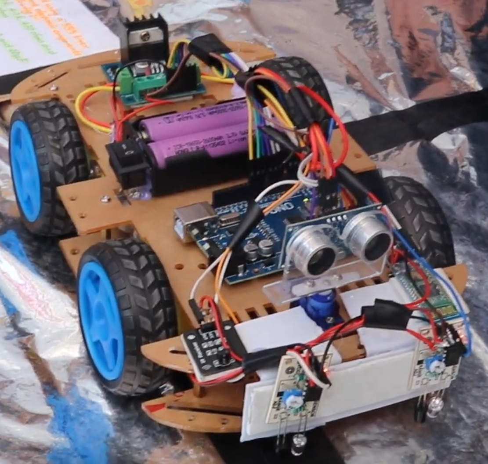
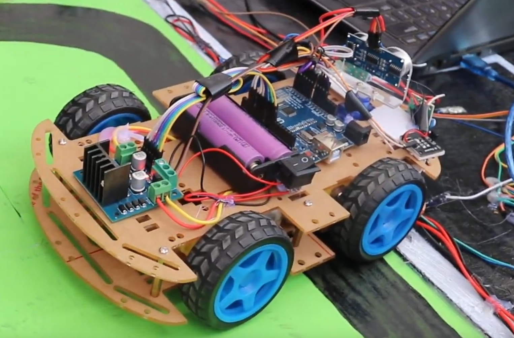
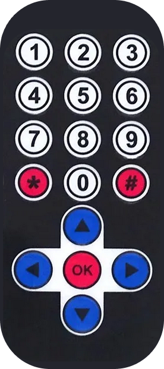

# 🤖 ALL_IN_ONE_ARDUINO_ROBOT

_A Line Follower + Obstacle Avoiding Robot Car Controlled by IR Remote & Mobile App_

---

## 📌 Introduction

Welcome to the **Arduino All-in-One Robot** project!  
This multipurpose robot combines **line following**, **obstacle avoidance**, and **remote/mobile control** into a single platform. It can be operated using:

- 🎛️ **IR Remote** (MP3 remote with custom button mapping)
- 📱 **Android App** (built with MIT App Inventor, includes Bluetooth & voice control)

This project is perfect for **students, hobbyists, and robotics enthusiasts** who want to explore autonomous navigation and interactive control systems.

---

## ⚙️ Features

- ✅ **Line Follower Mode** – Follows black/white paths using IR sensors
- ✅ **Obstacle Avoidance Mode** – Detects and avoids obstacles with ultrasonic sensor
- ✅ **Manual Control** – Operated via IR remote or Android app
- ✅ **Voice Commands** – Control robot with speech recognition
- ✅ **Speed Control** – Adjustable via mobile app slider
- ✅ **DIY Friendly** – Easy to assemble with common Arduino components

---

## 🧩 Components Required

| Component                          | Quantity  |
| ---------------------------------- | --------- |
| 5mm Acrylic Sheet (20cm x 12cm)    | 1         |
| DC Gear Motor                      | 4         |
| Arduino UNO                        | 1         |
| IR Sensor                          | 2         |
| L298 Motor Driver                  | 1         |
| HC-05 Bluetooth Module             | 1         |
| IR Receiver Module                 | 1         |
| MP3 Player IR Remote               | 1         |
| SG90 Servo Motor                   | 1         |
| Ultrasonic Sensor HC-SR04 + Holder | 1         |
| Robot Car Wheels                   | 4         |
| Jumper Wires (M-F)                 | As needed |
| On/Off Switch                      | 1         |
| 18650 Battery Holder (2-cell)      | 1         |
| 18650 Li-ion Battery (3.7V)        | 2         |

---

## 🔌 Circuit Overview

- **Power Supply:** 2 × 18650 batteries in series (7.4V)
- **Microcontroller:** Arduino UNO
- **Motor Driver:** L298N for left & right motors
- **Sensors:**
  - IR sensors → Line following & obstacle detection
  - Ultrasonic sensor → Distance measurement
- **Control Modules:**
  - HC-05 Bluetooth → Mobile app control
  - IR Receiver → Remote control
- **Servo Motor:** Rotates ultrasonic sensor for scanning

---

## 🎮 Control Mapping

### IR Remote

- `▲` → Move Forward
- `▼` → Move Backward
- `▶` → Turn Right
- `◀` → Turn Left
- `1` → Obstacle Avoidance Mode
- `2` → Line Follower Mode
- `3` → Manual Mode

### Mobile App (MIT App Inventor)

- **Buttons:** Forward, Backward, Left, Right, Stop
- **Voice Commands:** “Go Forward”, “Stop”, “Go Back”, “Turn Right”, “Turn Left”
- **Modes:** Line Following, Obstacle Avoidance, Manual
- **Slider:** Adjust robot speed

---

## 🎮 Command Mapping Table

| App Control (MIT Block)             | Data Sent (1‑Byte Number) | Arduino Code Interprets As | Robot Action                 |
| ----------------------------------- | ------------------------- | -------------------------- | ---------------------------- |
| **Forward (TouchDown)**             | `1`                       | `bt_ir_data == 1`          | Move Forward                 |
| **Backward (TouchDown)**            | `2`                       | `bt_ir_data == 2`          | Move Backward                |
| **Left (TouchDown)**                | `3`                       | `bt_ir_data == 3`          | Turn Left                    |
| **Right (TouchDown)**               | `4`                       | `bt_ir_data == 4`          | Turn Right                   |
| **Stop / Button Release (TouchUp)** | `0`                       | `bt_ir_data == 0` → Stop   | Stop Motors                  |
| **Stop Button (optional)**          | `5`                       | `bt_ir_data == 5`          | Stop Motors                  |
| **Voice Left**                      | `6`                       | `bt_ir_data == 6`          | Short Left Turn (momentary)  |
| **Voice Right**                     | `7`                       | `bt_ir_data == 7`          | Short Right Turn (momentary) |
| **Manual Mode**                     | `8`                       | `mode = 0`                 | Switch to Manual Control     |
| **Line Follower Mode**              | `9`                       | `mode = 1`                 | Enable Line Following        |
| **Obstacle Avoid Mode**             | `10`                      | `mode = 2`                 | Enable Obstacle Avoidance    |
| **Slider (Speed Control)**          | `21–255`                  | `Speed = data`             | Adjust Motor Speed (PWM)     |

---

## 📱 Mobile App Setup

- Install the provided **APK** on your Android device
- Or import the **AIA** file into [MIT App Inventor](https://appinventor.mit.edu/) to customize
- Connect via **Bluetooth (HC-05)** → Default pairing code usually `1234` or `0000`

---

## 🛠️ Arduino Setup

1. Install [Arduino IDE](https://www.arduino.cc/en/software)
2. Install required library: **IRremote**
3. Select **Arduino UNO** board & correct COM port
4. Upload the provided `.ino` code
5. Power the robot and test each mode

---

## 🧪 Hardware Testing

- Calibrate IR sensors for black/white surface detection
- Test IR remote buttons for movement & mode switching
- Verify Bluetooth connection with mobile app
- Test voice commands and speed control

---

## 📷 Demo & Media

### Robot Car Build

  
  

### 🎥 Full Demo on YouTube

### Remote

---

## 📚 Learning Outcomes

- Understanding of **autonomous navigation**
- Integration of **sensors, actuators, and wireless modules**
- Hands-on experience with **Arduino programming**
- Exposure to **MIT App Inventor mobile app development**

---

## ✅ Conclusion

The **ALL_IN_ONE_ARDUINO_ROBOT** is a complete robotics project that blends **hardware, software, and mobile interaction**. Whether you’re a beginner or an advanced maker, this project offers a **fun, educational, and practical** way to explore robotics.

---

## 📜 License

This project is licensed under the **Apache License 2.0** – see the [LICENSE](LICENSE) file for details.
